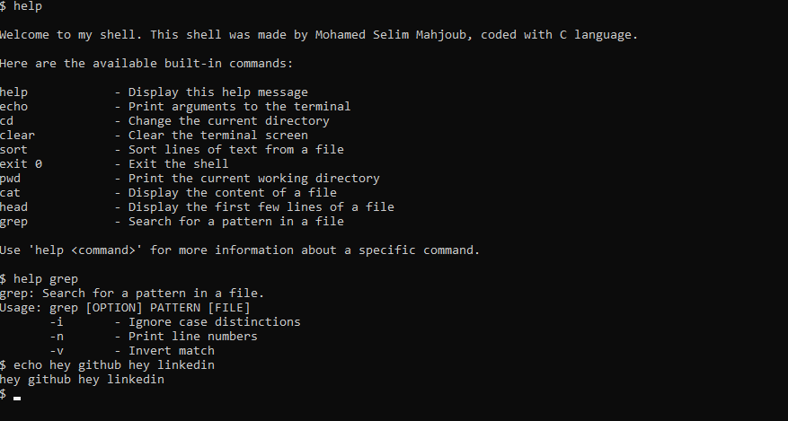

# Simple Shell in C

A minimalistic shell implementation in C that supports executing built-in commands (`echo`, `type`, `exit`) and external programs located via the `PATH` environment variable. This project demonstrates how to create a basic command-line interface (CLI) using POSIX-compliant system calls like `fork`, `execv`, and `waitpid`.

---

## Features

- **Built-in Commands**: `echo`, `type`, `exit`.
- **External Program Execution**: Executes programs from `PATH` with arguments.
- **POSIX-Compliant**: Works on Unix-like systems (Linux, macOS).

---

## Usage

1. Compile:
   ```bash
   gcc main.c -o simple_shell
   ```
2. Run:
   ```bash
   ./simple_shell
   ```
3. Example Commands:
   ```bash
   $ echo Hello, World!
   $ type ls
   $ ls
   $ exit 0
   ```

---

## Screenshot

  
*Example of the shell running built-in and external commands.*

---

## How It Works

- Parses user input and splits it into commands and arguments.
- Executes built-in commands directly or searches `PATH` for external programs.
- Uses `fork`, `execv`, and `waitpid` for process management.

---

